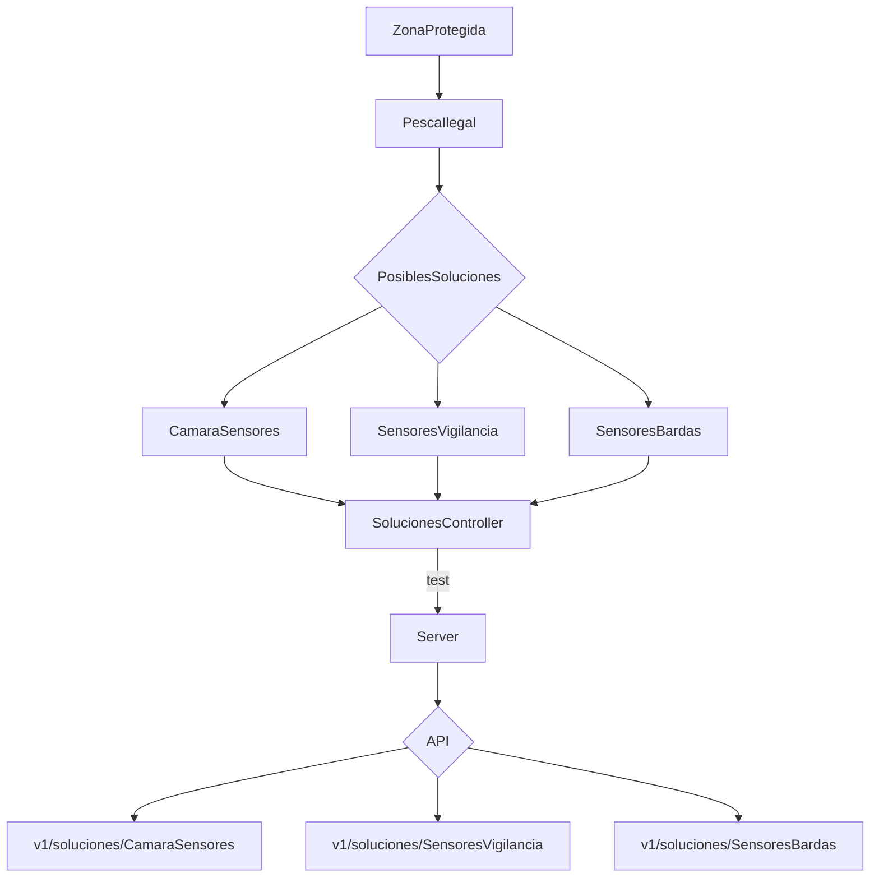

# OceanicProblematic
Un proyecto para la resolución de una problemática oceánica

| Integrantes | Rol | Link a los Gtihub |
| ------------- |:-------------:| -----:|
|`Alexis Aparicio`|FullStack|[Contacto](https://github.com/Alexis96-2)|
|`Luis Angel Baez`|FullStack|[Contacto](https://github.com/LuisBaezN)|
|`Diego Rafael Moctezuma`|FullStack|[Contacto](https://github.com/DiegoMoctezuma)|
|`Juan Pablo Pech`|FullStack|[Contacto](https://github.com/JPabloPQ)|
|`Azael Barbosa`|FullStack|[Contacto](https://github.com/AzaelBarbosa)|

## Pesca Ilegal en Zonas Protegidas


### Tecnologías a usar

- CSS
- JavaScript
- Html

> API considerada a usar: [Señala con Google Maps](https://www.cursosgis.com/como-crear-geometrias-con-la-api-javascript-de-google-maps/)

### Explicación de la problemática

Aquí va una explicación de la situación.

> Fuentes: https://thehumaneleague.org/article/fishing-industry

### Solución planteada

Aquí va una explicación de la solución tomada de acuerdo a la problemática.

### Dudas sobre codigos

```JavaScript
//Aquí codigos clave que requerimos investigar 1
```

```JavaScript
//Aquí codigos clave que requerimos investigar 2
```

### Tecloggías empleadas

- API leaflet
- CSS
- HTML
- JavaScript

> API usada al final: [Mapa leaflet](https://leafletjs.com/examples/quick-start/)