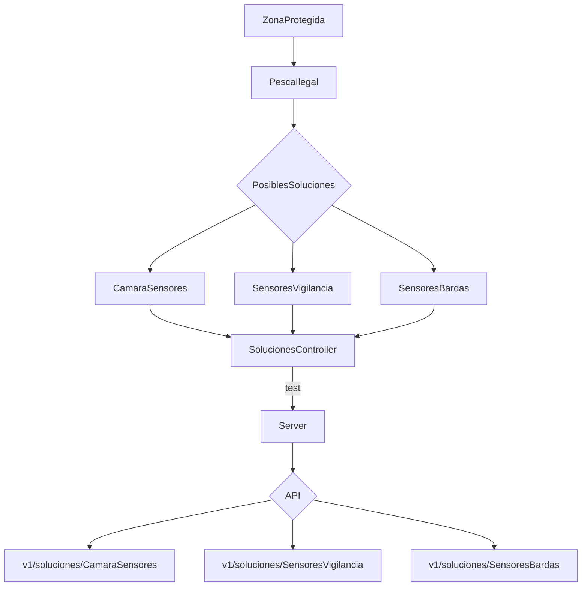

# OceanicProblematic
Un proyecto para la resolución de una problemática oceánica

| Integrantes | Rol | Link a los Gtihub |
| ------------- |:-------------:| -----:|
|`Alexis Aparicio`|FullStack - Lider|[Contacto](https://github.com/Alexis96-2)|
|`Luis Angel Baez`|Frontend|[Contacto](https://github.com/LuisBaezN)|
|`Diego Rafael Moctezuma`|FullStack|[Contacto](https://github.com/DiegoMoctezuma)|
|`Juan Pablo Pech`|Frontend|[Contacto](https://github.com/JPabloPQ)|
|`Azael Barbosa`|Backend|[Contacto](https://github.com/AzaelBarbosa)|

## Pesca Ilegal en Zonas Protegidas


### Tecnologías a usar

- API
- CSS
- JavaScript
- Html

> API para mapeo: [Mapa leaflet](https://leafletjs.com/examples/quick-start/) <br> Herramientas de servidor: [Azure Tools](https://marketplace.visualstudio.com/items?itemName=ms-azuretools.vscode-azureappservice) <br> Dependencias:
- npm install jest@26.0.0 --save
- npm install express --save

### Herramientas

- Visual Studio Code

> Extensiones: [VSCODE - Azure](https://code.visualstudio.com/docs/azure/extensions)

### Explicación de la problemática

Dentro del gran número de daños que le hemos causado al océano, la pesca ilegal en áreas marinas protegidas (MPA) representa un impacto muy alto a largo plazo, ya que se ha demostrado que estas áreas ayudan a recuperar la biodiversidad del oceano gracias al libre tránsito de especies. De no proteger la vida marina, los efectos del cambio climático incrementan más rápido.

Del total del océano, cerca del 6.35% está protegido, pero solo el 1.89% rigurosamente. Además, se sabe que si se pesca en el área limítrofe de las reservas, la población se reduce un 60% en una extención de 1km comparado con el área céntrica. A su vez, el 64% de las MPAs tienen un área menor a los 10,000 kilómetros cuadrados. Se estima que cerca del 20% al 30% de la comida marina importada proviene de pesca ilegal en zonas protegidas y se valora en más de $23.5 mil millones de dólares.

Desde hace 20 años se empezó a desarrollar un sistema de monitoreo electrónico (EM) para mejorar el proceso, monitorear el las trayectorias de pesca, evitar la sobre explotación, etc. Sin embargo, el sistema no ha tenido mucho éxito, aunque se tiene esperanza de que la tecnología se incorpore gracias a los avances tecnológicos, la reducción de costos, resurgimiento de la inteligencia artificial y las nuevas políticas. Por lo que por ahora este sistema no representa una solución de apoyo.


[Zonas protegidas de México](https://www.profepa.gob.mx/innovaportal/v/1380/1/mx.wap/areas_naturales_protegidas_marinas_y_litorales.html)

> Fuentes: <br> [Problematica de pesca ilegal](https://thehumaneleague.org/article/fishing-industry) <br> [Zonas protegidas de México](https://www.profepa.gob.mx/innovaportal/v/1380/1/mx.wap/areas_naturales_protegidas_marinas_y_litorales.html) <br> [Ubicación Geografíca de las zonas protegidas](https://simec.conanp.gob.mx/consulta_fichas.php)

### Solución planteada

Fish Savior es un sistema de monitoreo y respuesta ante la pesca ilegal dentro de MPAs.

Una patrulla consta de:
- Barco (1)
- Lanchas (3+)
- Drones (3+)

Procedimiento:
- Destino generado aleatoriamente
- Alcanzado el destino, despliega lanchas
- Después de alcanzar cierta distancia, despliega dron.
- Dron busca algun barco y registra si encuentra alguna anomalía.
- Si se encuentra alguna anomalía, alerta, si no, regresa.
- Repetir despliege de dron durante cierto límite de tiempo.
- Cambiar posición de monitoreo al terminar el tiempo en el primer espacio.

#### Alcance

En este proyecto se considera que el uso de drones y transmisión de información de lanchas a barco puede ser un problema, por lo que este pude ser un elemento que se puede escalar, por lo que se tomará a un solo barco como agente de monitoreo, respuesta, registro y análisis.

> API considerada a usar desde el principio: [Señala con Google Maps](https://www.cursosgis.com/como-crear-geometrias-con-la-api-javascript-de-google-maps/)

### Dudas sobre codigos

```JavaScript
// Aquí codigos clave que requerimos investigar 1
```

```JavaScript
// Aquí codigos clave que requerimos investigar 2
```

