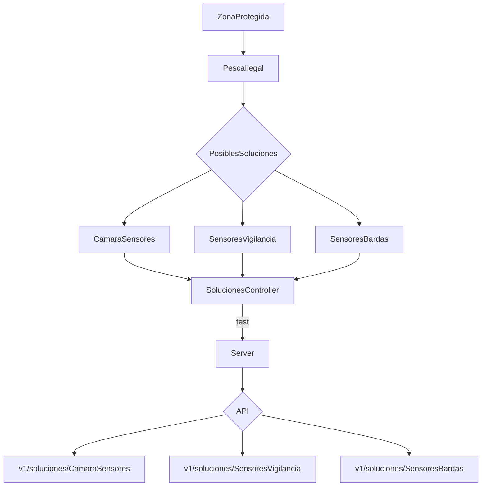

# OceanicProblematic
Un proyecto para la resolución de una problemática oceánica

| Integrantes | Rol | Link a los Gtihub |
| ------------- |:-------------:| -----:|
|`Alexis Aparicio`|FrontEnd - Backend|[Contacto](https://github.com/Alexis96-2)|
|`Luis Angel Baez`|FrontEnd - Backend|[Contacto](https://github.com/LuisBaezN)|
|`Diego Rafael Moctezuma`|FrontEnd - Backend|[Contacto](https://github.com/DiegoMoctezuma)|
|`Juan Pablo Pech`|FrontEnd - Backend|[Contacto](https://github.com/JPabloPQ)|
|`Azael Barbosa`|FrontEnd - Backend|[Contacto](https://github.com/AzaelBarbosa)|

### Pesca Ilegal en Zonas Protegidas

> API considerada a usar: [Señala con Google Maps](https://www.cursosgis.com/como-crear-geometrias-con-la-api-javascript-de-google-maps/)